# :crystal_ball: Automated mobile tests for Antimine: no guess minesweeper
<p align="center">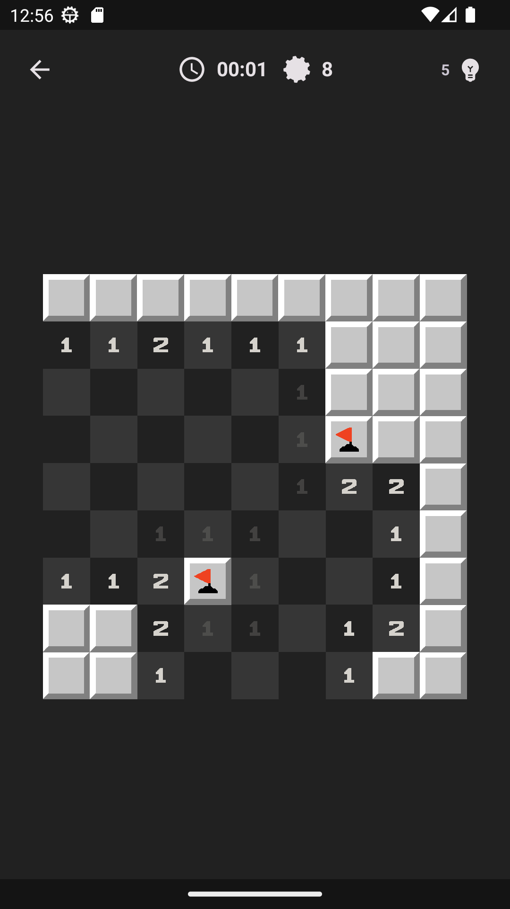
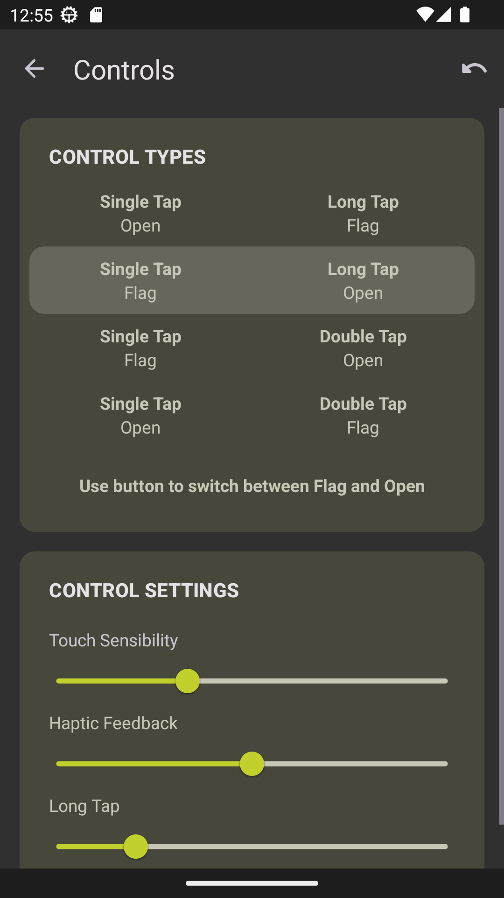
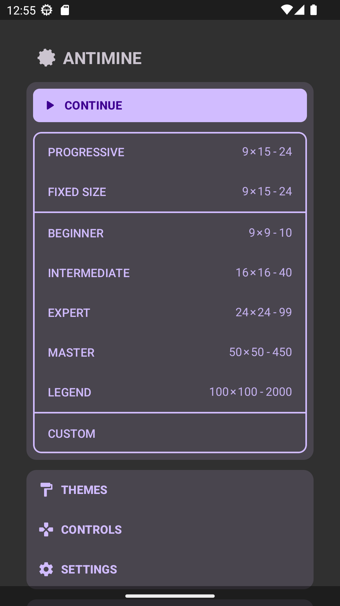
</p>

## :page_with_curl:	Contents
+ [Test cases run](#runner-test-cases-run)
+ [Instruments used](#toolbox-instruments-used)
+ [How to run these tests](#compass-how-to-run-these-tests)
    + [Using command prompt](#using-command-prompt)
    + [Using Jenkins](#using-jenkins)
+ [The final report in Allure Reports](#bar_chart-final-report-in-allure-reports)
+ [Allure TestOps integration](#dart-allure-testops-integration)
+ [Test results](#trophy-test-results)
+ [Jira integration](#ticket-jira-integration)

## :runner: Test cases run
### Automated test cases
- Main page tests
  - [x] Verify that the main page content is correct
  - [x] Verify that the ABOUT page content is correct
- Tutorial tests
  - [x] Verify that tutorial page content is correct
  - [x] Verify that a new game can be started directly from tutorial
### Manual test cases
- Main page
  - [x] Verify that all the buttons in the main menu are clickable
  - [x] Verify that background music is playing
- Settings
  - [x] Verify that the app opens with the system colors on the first launch
  - [x] Verify that the app theme can be changed


# :toolbox: Instruments used
<p  align="center">
  <code></code>
  <code></code>
  <code></code>
  <code></code>
  <code></code> 
  <code></code>
  <code></code>
  <code></code>
  <code></code>
  <code></code>
  <code></code>
  <code></code>
  <code></code>
  <code></code>

</p>

+ **Java** is the primary programming language for this project.
+ **Selenide** and **Appium** frameworks are used for writing the automated tests.
+ **JUnit 5** is used as a unit testing framework.
+ **Gradle** is used to build the project.
+ **Jenkins** is used for running the tests.
+ **Browserstack** is used to launch tests on remote devices.
+ **Allure Report** is used to visualize test results.
+ **Telegram API** is used for receiving the final report via Telegram Bot.


# :compass: How to run these tests

### Using command prompt

#### Remotely

To run the automated tests:
```bash
gradle clean test -Denv='browserstack'
```
To get the report:
```bash
allure serve build/allure-results
```
If there are issues with this method, that means that this project's Browserstack credentials have to be renewed due to the high demand. 
If you encountered this situation, please raise an issue, or contact me directly through email **alenashomanova@gmail.com**.


#### Locally

Preconditions for this method:
+ Android Studio is installed (with Virtual Device Manager available)
+ The following device is added:
>+ Device name: **Pixel 4 API 30**
>+ Platform version: **11.0**
+ The AVD is running in the emulator (:arrow_forward: button)

This is how the setup will look like: (press :arrow_forward:)
<p  align="center">
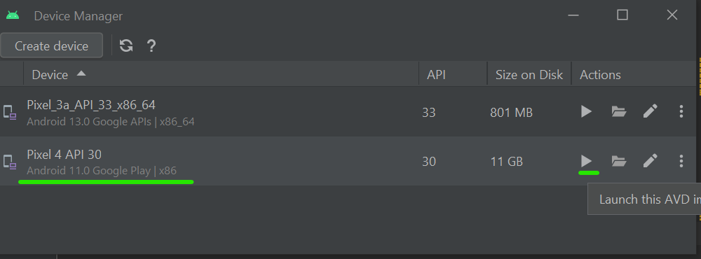
</p>

To run the automated tests:
```bash
gradle clean test -Denv='emulator'
```
To get the report:
```bash
allure serve build/allure-results
```

### Using [Jenkins](https://jenkins.autotests.cloud/job/c18-Ailinyan-antiminerMobileApp/)

Please note that the following method will run the tests remotely on [Browserstack](https://www.browserstack.com/) with the following parameters:

+ Device: **Google Pixel 3**
+ OS versiom: **9.0**

To run this test through Jenkins, please use this [job](https://jenkins.autotests.cloud/job/c18-Ailinyan-antiminerMobileApp/), specially created for this project.
The environment is set up for the Russian language, to run it please use the button with an :arrow_forward:.
You can see the results via Allure Reports, or use the link to Allure TestOps.

<p  align="center">
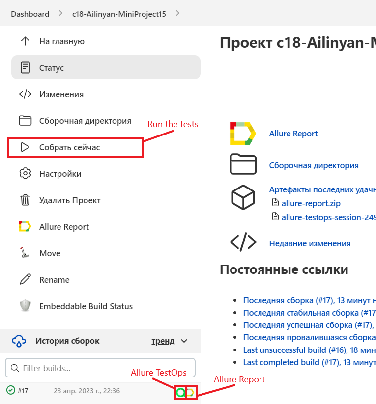
</p>


# :bar_chart: <a name="AllureReports">Final report in [Allure Reports](https://jenkins.autotests.cloud/job/c18-Ailinyan-MiniProject15/)</a>

#### Overview
The main page of the Allure report contains the following information blocks:

>- <code><strong>*ALLURE REPORT*</strong></code> - displays the following info for the given run:
>>- Date and time; 
>>- The total number of cases in the given run; 
>>- A pie chart indicating the percentage and number of test results: successful, failed, or broken.
>- <code><strong>*TREND*</strong></code> - a line chart that displays the trend of passing tests from build to build
>- <code><strong>*SUITES*</strong></code> - displays the distribution of test results across test suites
>- <code><strong>*CATEGORIES*</strong></code> - displays the distribution of failed tests sorted by defect types

<p align="center">
  
</p>


### List of tests with a description of steps and visualization of results

This page presents the standard distribution of the tests run by user stories and test suites.

<p align="center">
  
</p>


# :dart: [Allure TestOps](https://allure.autotests.cloud/project/25366/) integration

> [AllureTestOps project link](https://allure.autotests.cloud/project/25366) (access request: admin@qa.guru)

### Project's dashboards

#### Overview

<p align="center">
  
</p>

#### A sample custom dashboard

<p align="center">
  
</p>

### Project's test plans

<p align="center">
  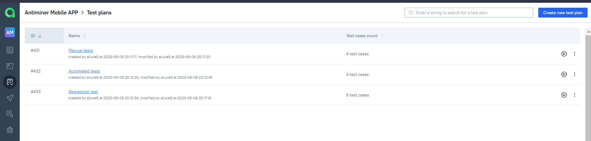
</p>

#### Manual test cases
<p align="center">
  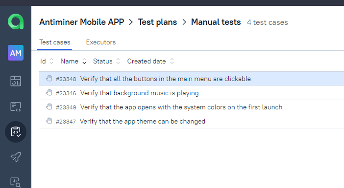
</p>

#### Automated test cases
<p align="center">
  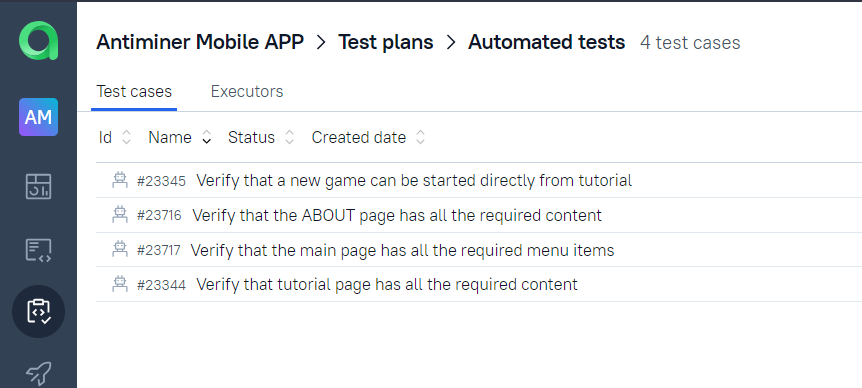
</p>

### All test cases
<p align="center">
  
</p>

### Launches
<p align="center">
  
</p>

### Launch details
<p align="center">
  
</p>

### Defects
<p align="center">
  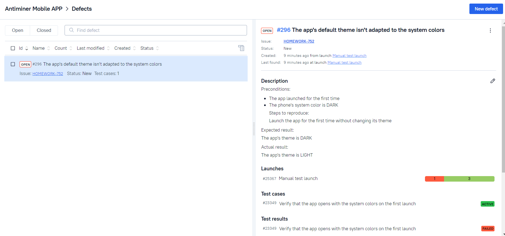
</p>


# :trophy: Test results

### Example of a report of an autotest

<p align="center">
  
</p>

### Video attachment example

There's a video attachment for each test available.

NOTE: the video can be saved only for **remote** runs.
<p align="center">
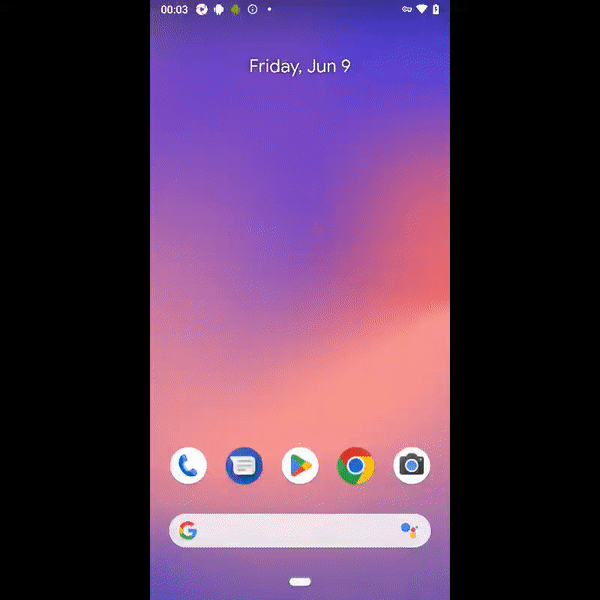
</p>

### Telegram notification example

<p align="center">
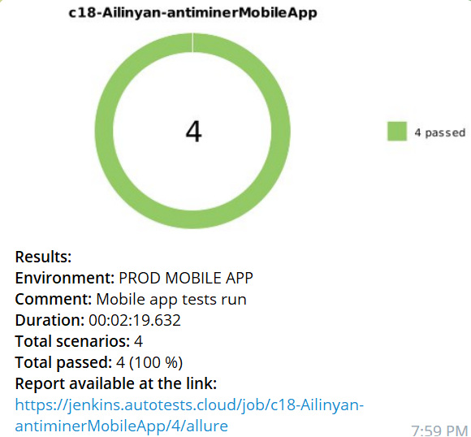
</p>


# :ticket: [Jira](https://jira.autotests.cloud/) integration

> [Jira task link](https://jira.autotests.cloud/browse/HOMEWORK-755) (access request: admin@qa.guru)

### [Ticket linked with Allure TestOps defect](https://jira.autotests.cloud/browse/HOMEWORK-752)
<p align="center">
  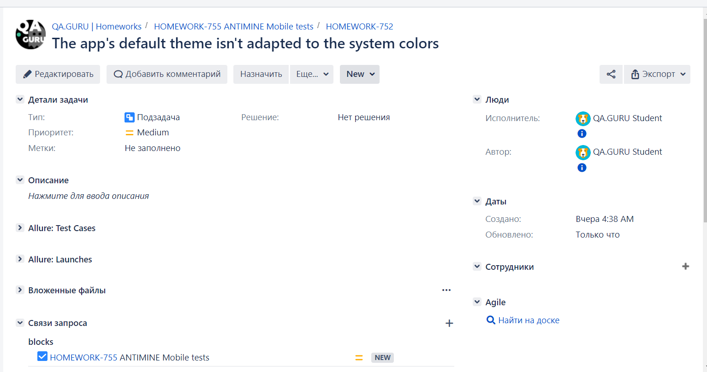
</p>

###  [Main Jira ticket for this project](https://jira.autotests.cloud/browse/HOMEWORK-755)
<p align="center">
  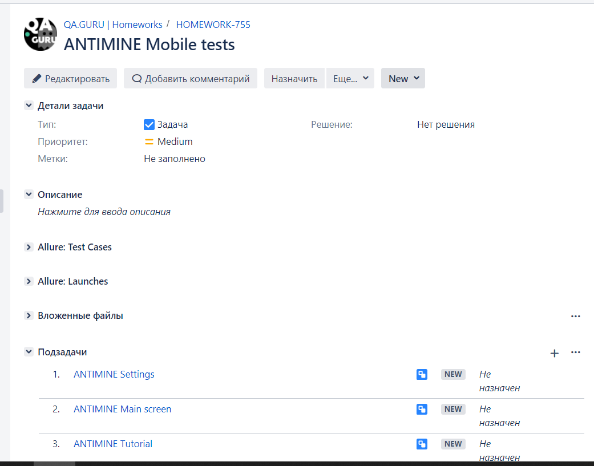
</p>


###  [An example of Jira task with integrated Allure test cases](https://jira.autotests.cloud/browse/HOMEWORK-756)
<p align="center">
  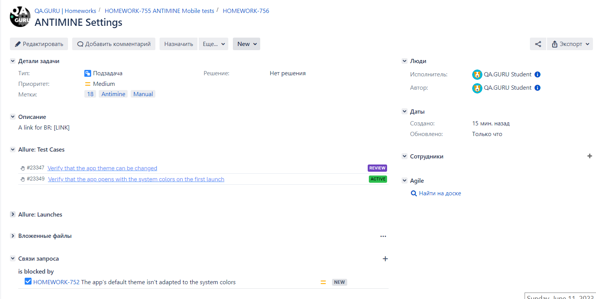
</p>